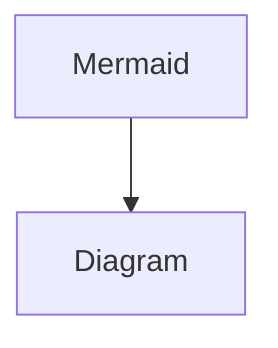

---
cover:
  image: cover.jpg
date: '2025-09-20T08:18:00.000Z'
draft: true
lastmod: '2025-10-06T06:18:00.000Z'
tags: []
title: Markdown

---

# Heading 1

Link to [GitHub](https://github.com/)

Lorem ipsum dolor sit amet, consectetur adipiscing elit. Ut sagittis commodo mauris, id semper ipsum condimentum sed. Nunc quam velit, malesuada et finibus a, laoreet vitae lacus. Morbi in augue sodales, semper tellus sed, scelerisque lacus. Pellentesque eu turpis non eros tristique malesuada. Quisque et magna eget lectus aliquet tempus. Donec ut nisl quis mauris tristique tincidunt. Sed eleifend facilisis enim, et gravida orci. Morbi erat ligula, commodo ut sapien non, blandit lacinia sem.

---

## Heading 2

Lorem ipsum dolor sit amet, consectetur adipiscing elit. Ut sagittis commodo mauris, id semper ipsum condimentum sed. Nunc quam velit, malesuada et finibus a, laoreet vitae lacus. Morbi in augue sodales, semper tellus sed, scelerisque lacus. Pellentesque eu turpis non eros tristique malesuada. Quisque et magna eget lectus aliquet tempus. Donec ut nisl quis mauris tristique tincidunt. Sed eleifend facilisis enim, et gravida orci. Morbi erat ligula, commodo ut sapien non, blandit lacinia sem.

---

### Heading 3

Lorem ipsum dolor sit amet, consectetur adipiscing elit. Ut sagittis commodo mauris, id semper ipsum condimentum sed. Nunc quam velit, malesuada et finibus a, laoreet vitae lacus. Morbi in augue sodales, semper tellus sed, scelerisque lacus. Pellentesque eu turpis non eros tristique malesuada. Quisque et magna eget lectus aliquet tempus. Donec ut nisl quis mauris tristique tincidunt. Sed eleifend facilisis enim, et gravida orci. Morbi erat ligula, commodo ut sapien non, blandit lacinia sem.

---

- [ ] To-do 1

	- [ ] To-do 2

		- [ ] To-do 3

- [x] To-do completed 1

	- [x] To-do completed 2

		- [x] To-do completed 3

---

1. Ordered list 1

1. Ordered list 2

	1. Ordered list 3

---

- Unordered list 1

- Unordered list 2

	- Unordered list 3

---

 | 11 | 12 | 13 | 
 | ---- | ---- | ---- | 
 | 21 | 22 | 23 | 
 | 31 | 32 | 33 | 

---

- Toggle list

	Lorem ipsum dolor sit amet, consectetur adipiscing elit. Ut sagittis commodo mauris, id semper ipsum condimentum sed. Nunc quam velit, malesuada et finibus a, laoreet vitae lacus. Morbi in augue sodales, semper tellus sed, scelerisque lacus. Pellentesque eu turpis non eros tristique malesuada. Quisque et magna eget lectus aliquet tempus. Donec ut nisl quis mauris tristique tincidunt. Sed eleifend facilisis enim, et gravida orci. Morbi erat ligula, commodo ut sapien non, blandit lacinia sem.

	1. Ordered list 1

	1. Ordered list 2

		1. Ordered list 3

			 | 11 | 12 | 13 | 
 | ---- | ---- | ---- | 
 | 21 | 22 | 23 | 
 | 31 | 32 | 33 | 

---

> Quote 1

	Quote 2

---

💡 Callout

	Callout content

	💡 Inner Callout

---

## Mentions

---

## Image

### Internal


### External


---

## Bookmark

[https://notion.hugodoit.com](https://notion.hugodoit.com)

DoIt

---

## Video

File

[//]: # (video is not supported)

YouTube

[//]: # (video is not supported)

---

## Audio

[//]: # (audio is not supported)

---

## Code


```c
#include <stdio.h>

int main() {
	printf("Hello world!")
}
```

---

## PDF

[//]: # (pdf is not supported)

## File

[Living-Guide](b30093de_Living-Guide.pdf)

---




## Embed

[https://twitter.com/NoContextBrits/status/1561790234811146243](https://twitter.com/NoContextBrits/status/1561790234811146243)

[https://github.com/](https://github.com/)

## Maths

Inline maths equation: $ c = \pm\sqrt{a^2 + b^2} $

Block maths equation:

$$ c = \pm\sqrt{a^2 + b^2} $$

