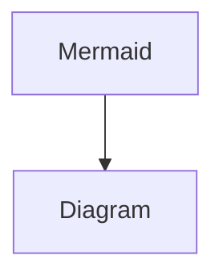

---
cover:
  image: cover.jpg
date: '2025-09-20T08:18:00.000Z'
draft: true
lastmod: '2025-10-06T06:18:00.000Z'
tags: []
title: Markdown

---

# Heading 1

---

## Heading 2

---

### Heading 3

---

- [ ] To-do 1

	- [ ] To-do 2

		- [ ] To-do 3

- [x] To-do completed 1

	- [x] To-do completed 2

		- [x] To-do completed 3

---

1. Ordered list 1

1. Ordered list 2

	1. Ordered list 3

---

- Unordered list 1

- Unordered list 2

	- Unordered list 3

---

 | 11 | 12 | 13 | 
 | ---- | ---- | ---- | 
 | 21 | 22 | 23 | 
 | 31 | 32 | 33 | 

---

- Toggle list

		1. Ordered list 1

	1. Ordered list 2

		1. Ordered list 3

			 | 11 | 12 | 13 | 
 | ---- | ---- | ---- | 
 | 21 | 22 | 23 | 
 | 31 | 32 | 33 | 

---

> Quote 1

	---

💡 Callout

		💡 Inner Callout

---

## Mentions

---

## Image

### Internal


### External


---

## Bookmark

[https://notion.hugodoit.com](https://notion.hugodoit.com)

DoIt

---

## Video

[//]: # (video is not supported)

[//]: # (video is not supported)

---

## Audio

[//]: # (audio is not supported)

---

## Code


```c
#include <stdio.h>

int main() {
	printf("Hello world!")
}
```

---

## PDF

[//]: # (pdf is not supported)

## File

[Living-Guide](b30093de_Living-Guide.pdf)

---



```mermaid
graph TD
  Mermaid --> Diagram
```

## Embed

[https://twitter.com/NoContextBrits/status/1561790234811146243](https://twitter.com/NoContextBrits/status/1561790234811146243)

[https://github.com/](https://github.com/)

## Maths

$$ c = \pm\sqrt{a^2 + b^2} $$

