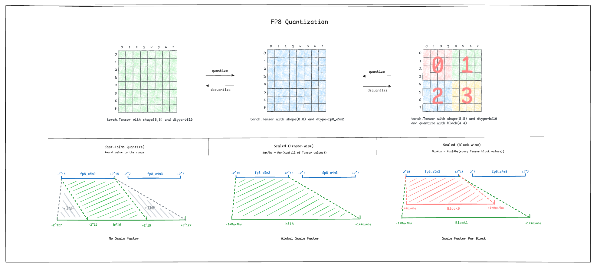

---
cover:
  image: cover.jpg
date: '2025-10-13T12:22:00.000Z'
draft: false
lastmod: '2025-10-15T03:45:00.000Z'
tags:
- AI
- PyTorch
title: fp8 量化的几种姿势

---

# 背景

今年以来，在图像视频领域，开源的 AIGC 模型参数规模越来越大，例如，QwenImage 达到了 20B，Wan2.2 达到了 27B（High-Noise 和 Low-Noise 专家各占用 14B）。参数规模越大，就意味着需要更多的显存来加载模型，需要更多的算力来进行模型推理。而此时如果你想将这些 SOTA 模型运行在更加经济的消费级显卡时，就需要对模型进行量化（可以理解为压缩）。对于一张 24GB 显存的 4090 显卡而言，如果想要加载 QwenImage 20B 模型，就必须将模型权重量化到 fp8 精度。具体估算方式如下：


```python
num_params = 20 * 2^30
fp8_size = 1 byte

total_size = num_params * fp8_size = 20 * 2^30 * 1 byte = 20 GBytes
```

最近 musubi-tuner 的作者正在比较不同 fp8 量化方式对图片生成结果的影响，正好我对 ComfyUI 模型使用的 fp8_e4m3、fp8_e4m3fn、fp8_e5m2 等不同的 fp8 精度也一知半解，于是决定做一次系统的学习与整理。

# 关于精度与量化


浮点精度相信大家都不陌生，只不过接触比较多可能是 float32 单精度浮点数或者 float64 双精度浮点数。简单来说，浮点数的表示分为「符号位」、「指数位」、「尾数位」三个部分，如上图所示，其中每个色块代表一个 bit。你会发现 float8 精度有两个表示方式，fp8_e4m3 和 fp8_e5m2，不同的表示意味着不同的取值范围。

而所谓的量化，其实是将数值从较大的精度范围（bf16）缩小到较小的精度范围（fp8_e4m3）；反量化则刚好相反。

另外，可能还会看到 `fp8_e4m3fn`、`fp8_e4m3fnuz` 等精度，其中 `fn` 代表没有无穷值，`uz` 代表没有负零。

# FP8 的几种量化方式



将 bf16 精度的数值量化到 fp8_e5m2 精度，有以下 3 种方式：

1. Cast-To：该方法不属于量化范畴，只是简单的数值转换。可以发现灰色部分会被直接映射到 INF 或者 -INF 上。代码验证：

	
```shell
>>> v = torch.finfo(torch.bfloat16).max
>>> v
3.3895313892515355e+38
>>> tv=torch.Tensor(v)
>>> [tv.to](http://tensor.to/)(torch.float8_e5m2)
tensor([inf], dtype=torch.float8_e5m2)
```

1. Tensor-wise FP8 量化：对于每个 Tensor（模型是由多个 Tensor 组成，Tensor 中包含一组参数），找出当前参数数值的最小取值范围，并将这个范围映射到 fp8 的范围内。该过程就是量化，其中映射过程会有一个缩放因子，通过缩放因子可以对参数进行反量化。

1. Block-wise FP8 量化：将每个 Tensor 按照固定 block 大小切分成多个 block，在对 block 中的参数按 Tensor-wise 的方法进行量化，区别在于每个 block 会有一个缩放因子。这个方法粒度更细，精度相对会更高。

⚠️ 图中不同精度的范围为粗略值，仅展示使用。

# Tensor-wise FP8 量化模型布局比较


在 Kijai 大神量化的 fp8_scale 模型中，可以看到每个 weight 同级新增了 scale_weight 用于记录缩放因子。

# 细粒度量化 (Fine-grained quantization)

> HuggingFace transformers 库中提供了对 block-wise fp8 量化方式的支持


# 参考资料

- [Wan-AI/Wan2.2-T2V-A14B · Hugging Face](https://huggingface.co/Wan-AI/Wan2.2-T2V-A14B)

- [https://huggingface.co/docs/transformers/en/quantization/finegrained_fp8](https://huggingface.co/docs/transformers/en/quantization/finegrained_fp8)

- [https://www.aidoczh.com/onnx/technical/float8.html](https://www.aidoczh.com/onnx/technical/float8.html)

- [[Research] FP8 Quantization Impact Study for DiT Models - Ongoing Results · kohya-ss musubi-tuner · Discussion #564](https://github.com/kohya-ss/musubi-tuner/discussions/564)

- [zhuanlan.zhihu.com](https://zhuanlan.zhihu.com/p/574825662)

- [https://developer.nvidia.com/zh-cn/blog/fp8-challenges-best-practices/](https://developer.nvidia.com/zh-cn/blog/fp8-challenges-best-practices/)

<br/>

