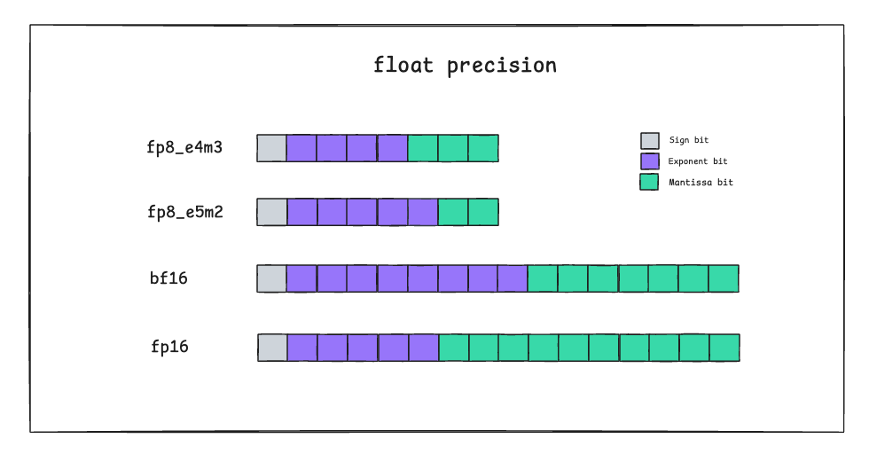
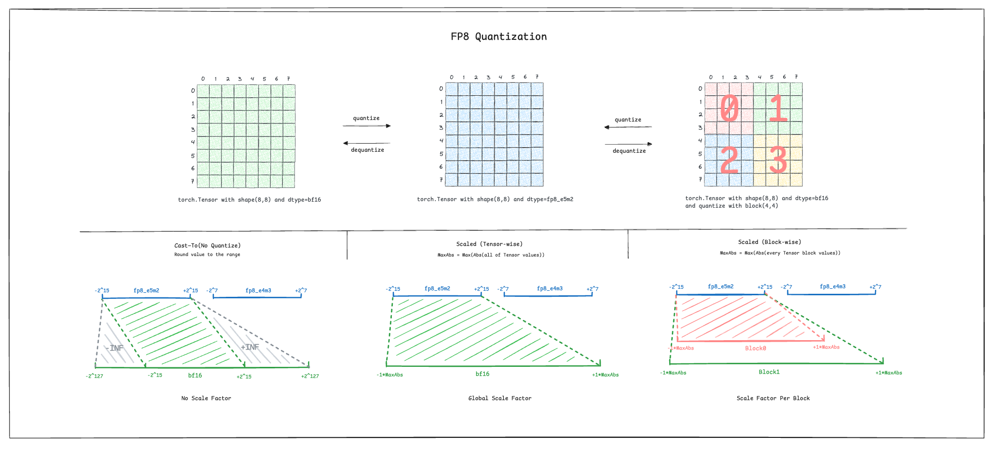
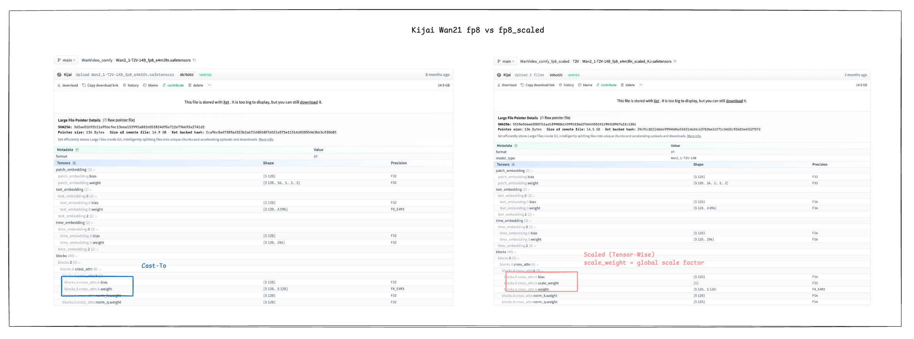
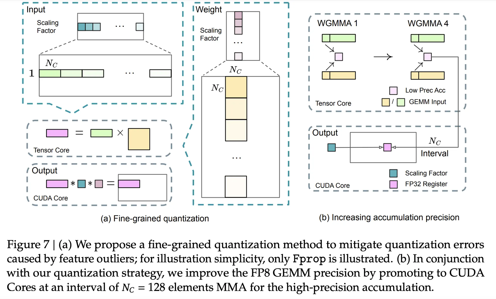

---
cover:
  image: cover.jpg
date: '2025-10-13T12:22:00.000Z'
draft: false
lastmod: '2025-10-23T13:32:00.000Z'
tags:
- AI
- PyTorch
title: fp8 量化的几种姿势

---

# 背景


```python
num_params = 20 * 2^30
fp8_size = 1 byte

total_size = num_params * fp8_size = 20 * 2^30 * 1 byte = 20 GBytes
```

# 关于精度与量化



# FP8 的几种量化方式



1. Cast-To：该方法不属于量化范畴，只是简单的数值转换。可以发现灰色部分会被直接映射到 INF 或者 -INF 上。代码验证：

	
```html
>>> v = torch.finfo(torch.bfloat16).max
>>> v
3.3895313892515355e+38
>>> tv=torch.Tensor(v)
>>> tv.to(torch.float8_e5m2)
tensor([inf], dtype=torch.float8_e5m2)
```

1. Tensor-wise FP8 量化：对于每个 Tensor（模型是由多个 Tensor 组成，Tensor 中包含一组参数），找出当前参数数值的最小取值范围，并将这个范围映射到 fp8 的范围内。该过程就是量化，其中映射过程会有一个缩放因子，通过缩放因子可以对参数进行反量化。

1. Block-wise FP8 量化：将每个 Tensor 按照固定 block 大小切分成多个 block，在对 block 中的参数按 Tensor-wise 的方法进行量化，区别在于每个 block 会有一个缩放因子。这个方法粒度更细，精度相对会更高。

# Tensor-wise FP8 量化模型布局比较



# 细粒度量化 (Fine-grained quantization)

> HuggingFace transformers 库中提供了对 block-wise fp8 量化方式的支持



# 参考资料

- [Wan-AI/Wan2.2-T2V-A14B · Hugging Face](https://huggingface.co/Wan-AI/Wan2.2-T2V-A14B)

- [https://huggingface.co/docs/transformers/en/quantization/finegrained_fp8](https://huggingface.co/docs/transformers/en/quantization/finegrained_fp8)

- [https://www.aidoczh.com/onnx/technical/float8.html](https://www.aidoczh.com/onnx/technical/float8.html)

- [[Research] FP8 Quantization Impact Study for DiT Models - Ongoing Results · kohya-ss musubi-tuner · Discussion #564](https://github.com/kohya-ss/musubi-tuner/discussions/564)

- [zhuanlan.zhihu.com](https://zhuanlan.zhihu.com/p/574825662)

- [https://developer.nvidia.com/zh-cn/blog/fp8-challenges-best-practices/](https://developer.nvidia.com/zh-cn/blog/fp8-challenges-best-practices/)

<br/>

