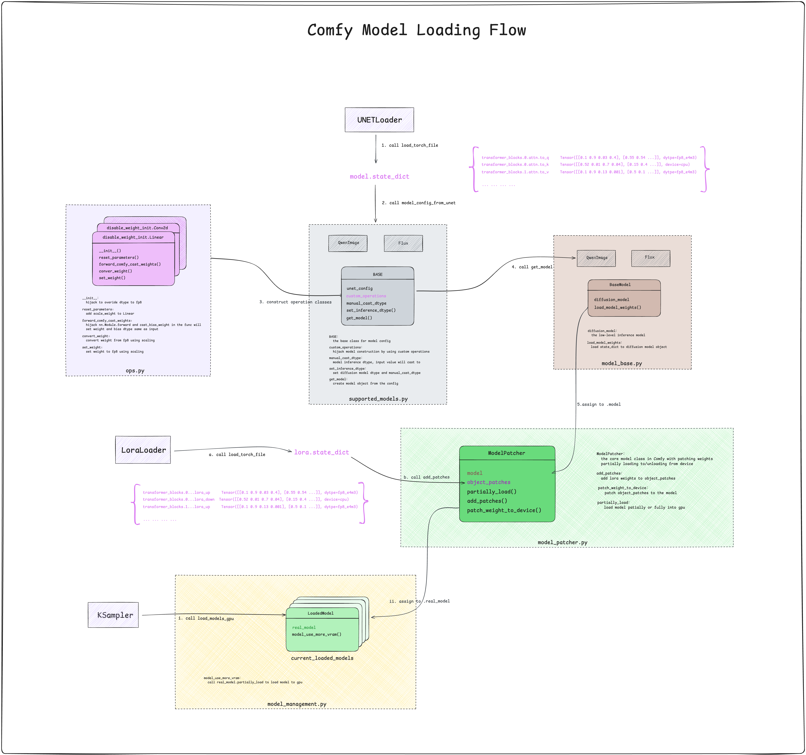

---
cover:
  image: cover.jpg
date: '2025-10-18T01:41:00.000Z'
draft: true
lastmod: '2025-10-18T07:05:00.000Z'
tags:
- Comfy
title: ComfyUI 模型加载分析 & 自定义量化算子

---

# 背景

前文提到 musubi-tunner 作者自己实现了 block-wise fp8 scaling，并且代码非常精简，但是 ComfyUI 还没有对此进行支持。而在 [https://github.com/kohya-ss/musubi-tuner/issues/634](https://github.com/kohya-ss/musubi-tuner/issues/634) 中也提到了想要使用 ComfyUI 来体验 block-wise fp8 scaling。

ComfyUI 接触也有一段时间，决定来手搓一个插件。在搓插件之前，需要先理解 ComfyUI 当前加载模型的逻辑。在 ComfyUI 中，官方提供了加载 diffusion 模型的节点 UNetLoader、加载 LoRA 模型的节点 LoraLoader、以及运行模型的节点 KSampler。

这里还有一点提下，VSCode + 单步调试 + Github Copilot 简直是查看 Python 代码的绝佳组合，非常高效。

# 模型加载过程图

三个核心节点：

1. UNETLoader：从硬盘读取模型文件，根据文件内容判断模型类型，并生成模型对象，最终加载模型到 cpu 上，得到 ModelPatcher

1. LoraLoader：从硬盘读取模型文件，并将模型数据保存在 ModelPatcher 的 object_patches 字段中

1. KSampler：将 ModelPatcher 中存放的 lora 权重合并到 model 上，随后加载到 GPU 上，最后运行推理

# 自定义算子，加载 block wise scaled 模型

> 场景一：参考 kijai 大神的做法，先使用 block wise scaling 方法将 QwenImage 量化后导出模型文件，然后在使用 ComfyUI 时加载量化后的模型。

为满足这个场景，可以按以下思路来做：

- 劫持 `__init__` 方法，用于设置模块的 dtype，例如，fp8_e4m3，后续在 load_state_dict 时会将具体的数值 cast_to 到该 dtype 上

- 劫持 `reset_parameters` 方法，用于为模块新增参数。在 block wise scaling 场景下，模型中会多一个 scale_weight 字段，该字段在原始模型结构中不存在。因此，需要通过 reset_parameters 新增 scale_weight 参数。

- 劫持 `forward` 方法，用于接入自定义 foward 逻辑。在 block wise scaling 场景下，需要先将加载的权重通过 scale_weight 反量化成 bf16，然后执行 forward 运算。

具体实现如下：[https://github.com/polym/ComfyUI-musubi/blob/main/modules/comfy_ops.py](https://github.com/polym/ComfyUI-musubi/blob/main/modules/comfy_ops.py)

# 如何在线量化？

> 场景二：将 LoRA 权重加载到 QwenImage 模型后再进行量化。

针对该场景，ComfyUI 原生 UNETLoader 节点，在完成模型加载后就无法再次进行量化，因此无法满足需求。我们需要自己来实现模型加载、LoRA 权重合并以及量化等过程，然后以 ModelPatcher 的形式返回。这里遇到一个问题，需要正确使用 set_inference_dtype 设置 dtype。具体细节不做展开，可以查看 [https://github.com/polym/ComfyUI-musubi/blob/main/modules/nodes.py#L68](https://github.com/polym/ComfyUI-musubi/blob/main/modules/nodes.py#L68)

# 其他思考

1. 为什么 LoadLora 时没有立即将 LoRA 权重合并到模型上，而是做了保存？

	初步想法💡：为了能够有效的复用加载后的 diffusion model，支持在线合并/卸载 LoRA 权重。

1. 如果模型的部分权重被 offload 到 cpu 上，在模型推理时，如何保证运算的数据同时在 cpu 或者 gpu 上？

	首先，Comfy 默认会劫持所有常见的 torch.nn.Module，在 forward 函数中，通过 cast_weight_bias 方法，将 weight 和 bias 的临时变量转成 input 的 dtype 和 device。因此，可以保证所有的运算都会在同一个设备上执行。但是，我们在实际使用 ComfyUI 时还是可能遇到 **Expected all tensors to be on the same device 的报错，这个需要具体问题具体分析。**

 

