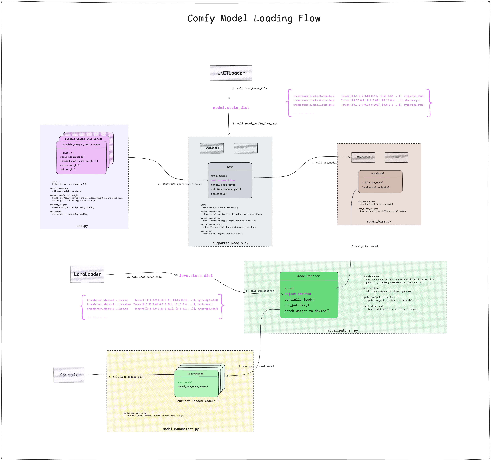

---
cover:
  image: cover.jpg
date: '2025-10-18T01:41:00.000Z'
draft: false
lastmod: '2025-10-20T08:40:00.000Z'
tags:
- Comfy
title: ComfyUI 模型加载分析 & 自定义量化算子

---

# 背景

# 模型加载过程图

1. UNETLoader：从硬盘读取模型文件，根据文件内容判断模型类型，并生成模型对象，最终加载模型到 cpu 上，得到 ModelPatcher

1. LoraLoader：从硬盘读取模型文件，并将模型数据保存在 ModelPatcher 的 object_patches 字段中

1. KSampler：将 ModelPatcher 中存放的 lora 权重合并到 model 上，随后加载到 GPU 上，最后运行推理

# 自定义算子，加载 block wise scaled 模型

> 场景一：参考 kijai 大神的做法，先使用 block wise scaling 方法将 QwenImage 量化后导出模型文件，然后在使用 ComfyUI 时加载量化后的模型。

- 劫持 `__init__` 方法，用于设置模块的 dtype，例如，fp8_e4m3，后续在 load_state_dict 时会将具体的数值 cast_to 到该 dtype 上

- 劫持 `reset_parameters` 方法，用于为模块新增参数。在 block wise scaling 场景下，模型中会多一个 scale_weight 字段，该字段在原始模型结构中不存在。因此，需要通过 reset_parameters 新增 scale_weight 参数。

- 劫持 `forward` 方法，用于接入自定义 foward 逻辑。在 block wise scaling 场景下，需要先将加载的权重通过 scale_weight 反量化成 bf16，然后执行 forward 运算。

# 如何在线量化？

> 场景二：将 LoRA 权重加载到 QwenImage 模型后再进行量化。

# 其他思考

1. 为什么 LoadLora 时没有立即将 LoRA 权重合并到模型上，而是做了保存？

	1. 如果模型的部分权重被 offload 到 cpu 上，在模型推理时，如何保证运算的数据同时在 cpu 或者 gpu 上？

	 

