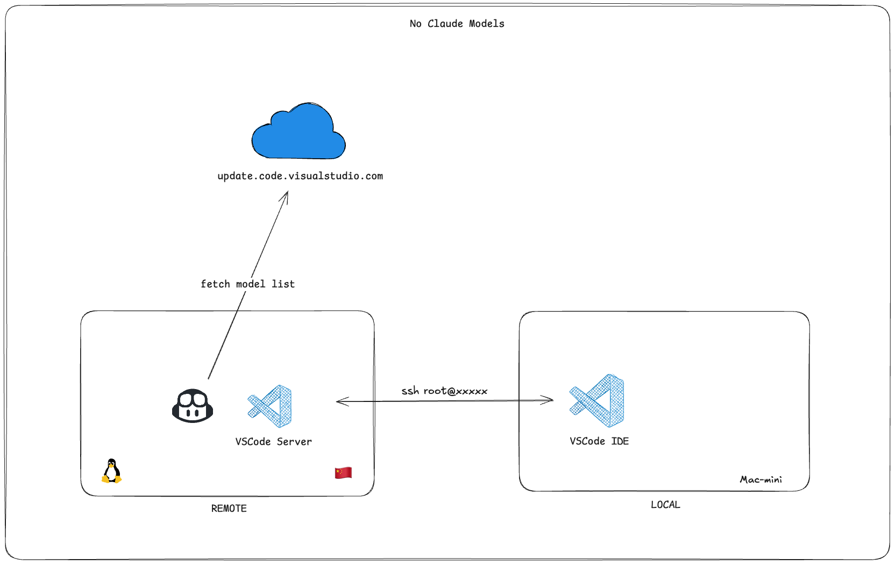
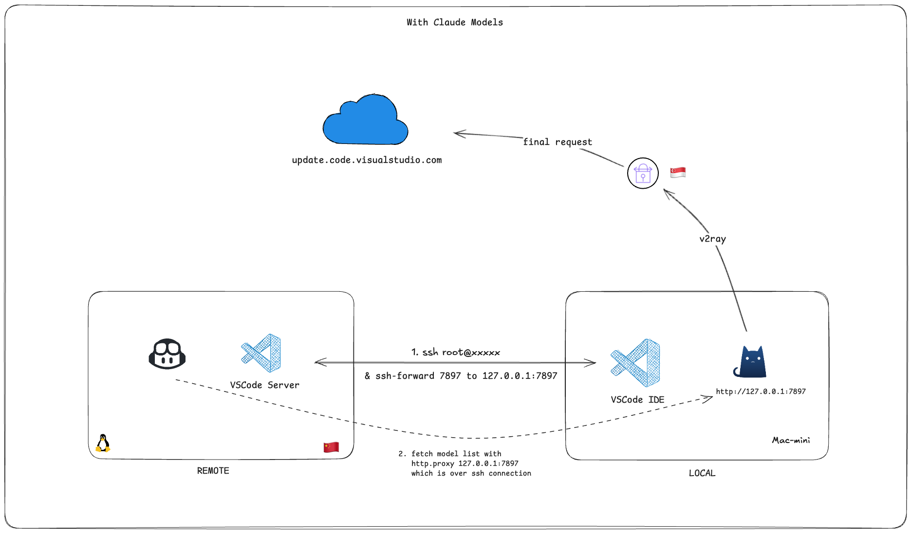
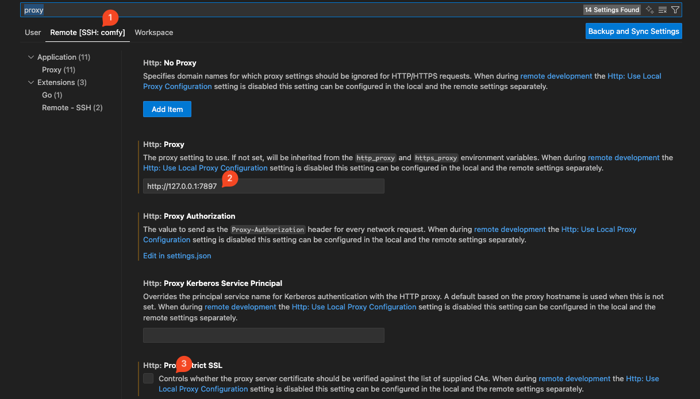

---
cover:
  image: cover.jpg
date: '2025-10-28T12:49:00.000Z'
draft: false
lastmod: '2025-10-29T13:42:00.000Z'
tags:
- Copilot
title: Github Copilot remote-ssh 支持 Claude 系列模型

---

# 背景

最近这段时间，由于开发过程中都会用到 GPU 卡且对配置也有较高的要求，自己的开发机已经无法满足需求，所以索性就把开发环境搬到了公司的云产品上。开发方式：在本地的 Mac-mini 上通过 VSCode remote-ssh 连接到机器上进行开发。但是遇到了一个奇怪的问题，Github copilot 中 Claude 系列模型消失了。而同样的方式连接到自己的 4090 开发机没遇到这个问题。分析了下，觉得可能是网络的出口有关系，4090 开发机在公司环境，默认走香港线路，而公司的云机，默认走国内线路。不经联想到最近 Anthropic 对 Claude 模型提出的新限制，不禁挺佩服 Anthropic 对规则的坚持🤦。

# 原因分析

公司的 GPU 云机所在机房在国内，虽然也有科学上网代理，但是由于白名单中未对相关域名放开，所以还是默认走国内出口，由于 Anthropic 官方的限制要求，导致在获取模型列表时，无法获取到 Claude 模型。



# 解决思路



方案比较简单，就是对远程 VSCode Server 设置 http.proxy，将所有流量回传到 Mac-mini 上的 Clash 上，由 Clash 来转发流量从新加坡出口去请求模型列表。具体步骤如下：

1. 在本地 .ssh/config 配置中，找到需要远程连接的主机，增加 RemoteForward 配置。有了这个配置，就会在 ssh 连接时，自动创建端口转发，将 remote 机器上所有请求 7897 端口的流量都转发到 local 机器的 127.0.0.1:7897 上。

	
```json
Host comfy
    HostName ngb1.dc.huixingyun.com
    User root
    Port 53727
    PubkeyAuthentication yes
    IdentityFile ~/.ssh/id_rsa
    RemoteForward 7897 127.0.0.1:7897
```

1. 在 VSCode 的 Remote-ssh 配置中设置 http.proxy

	

# 参考资料

1. [VsCode远程Copilot无法使用Claude Agent问题_vscode远程没有claude-CSDN博客](https://blog.csdn.net/qq_40620465/article/details/152000104)

1. [Updating restrictions of sales to unsupported regions](https://www.anthropic.com/news/updating-restrictions-of-sales-to-unsupported-regions)

