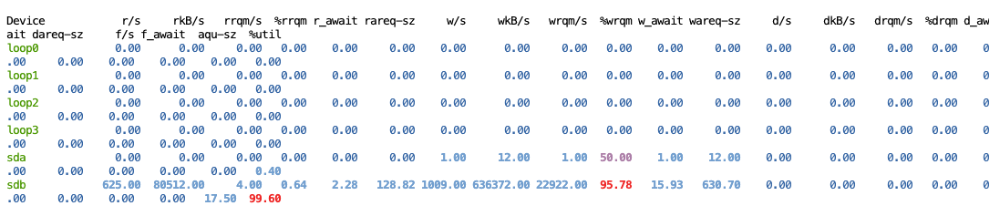
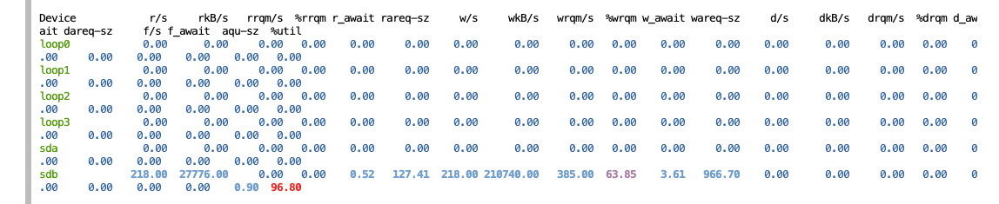
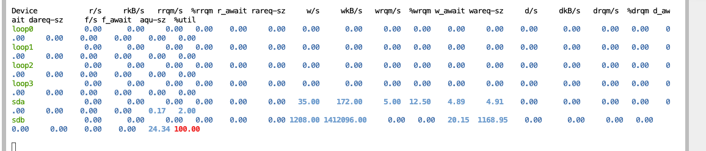

---
cover:
  image: cover.jpg
date: '2025-10-28T09:31:00.000Z'
draft: true
lastmod: '2025-11-03T13:37:00.000Z'
tags: []
title: '容器镜像压缩 Gzip vs Zstd vs Pigz '

---

## 背景

 

> [https://docs.docker.com/build/exporters/image-registry/](https://docs.docker.com/build/exporters/image-registry/)

 

 

 

 

1. 为什么 zstd 比 uncompressed？

	1. 为什么 gzip 最慢？

	