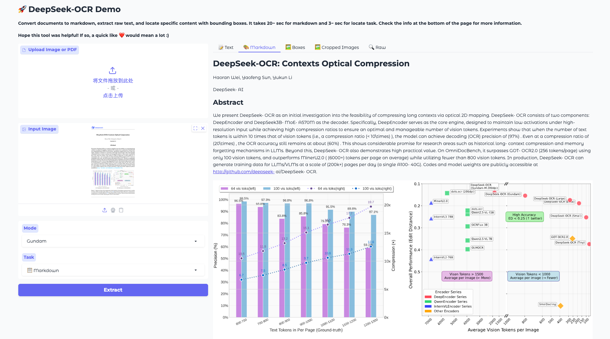
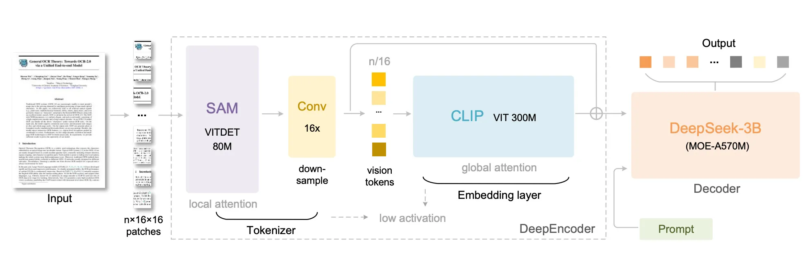

---
cover:
  image: cover.jpg
date: '2025-11-08T04:25:00.000Z'
draft: false
lastmod: '2025-11-09T08:06:00.000Z'
tags:
- AI
title: DeepSeek OCR 实操和论文学习

---

# 部署体验

以 Nvidia 4090 + Nvidia-driver-580 驱动为例：


```bash
git clone https://github.com/deepseek-ai/DeepSeek-OCR.git && cd DeepSeek-OCR

conda create -n ocr python=3.12
conda install cuda-toolkit=12.8

pip install torch==2.8.0 torchvision==0.23.0 torchaudio==2.8.0 --index-url https://download.pytorch.org/whl/cu128
pip install -r requirement.py

python DeepSeek-OCR-master/DeepSeek-OCR-hf/run_dpsk_ocr.py
```

也可以直接体验：[https://huggingface.co/spaces/merterbak/DeepSeek-OCR-Demo](https://huggingface.co/spaces/merterbak/DeepSeek-OCR-Demo)



# 模型架构



总体包含两个部分「DeepEncoder」和「LLM」。其中「DeepEncoder」由 「SAM」+「CLIP」模型结构组成，而「LLM」使用的是 DeepSeek-3B。

模型推理过程如下：

1. 将输入的图片进行切分，得到 n 个 16x16 patches 图片块

1. 使用 SAM 模型获取局部的 attention，并采用 16x 的下采样将 vision token 压缩到 n/16 个

1. 将 vision token 逐个输入到 CLIP 模型，得到图片块的 Embedding

1. 将图片块的 Embedding 和 Prompt 对应的 Embedding 合并作为输入，喂给 DeepSeek-3B

1. DeepSeek-3B 根据输入语义，完成实际的任务

# Q&A 自问自答

### Q1. DeepSeek-3B 作为 backbone 时参数是否冻结？

没有冻结。无论是 SAM、CLIP、DeepSeek-3B 的所有参数均可以调整。

### Q2. SAM/CLIP/DeepSeek-3B 间的维度如何对齐？

利用卷积层和投影层。

- 在 SAM ⇒ CLIP 中间有一个 16x 的卷积层，可以特征向量缩放到 1024。这与 CLIP 模型的特征向量维度一致。

- 在 CLIP ⇒ DeepSeek-3B 中间有一个投影层，会将特征向量维度缩放到 1280。值得注意的是，在投影层前会将 SAM 输出的 1024 维特征向量与 CLIP 输出的 1024 维特征向量进行拼接，然后再进行投影。


```bash
n_embed = 1280  # 目标输出维度
self.projector = MlpProjector(Dict(
    projector_type="linear", 
    input_dim=2048,      # 输入维度: CLIP + SAM = 2048
    n_embed=n_embed      # 输出维度: 1280
))
```

### Q3. Vision token 和 Prompt 如何作为 DeepSeek-3B 的 input？

首先 Vision tokens 和 Prompt 对应的 Embedding 都是 1280 维度的，一个是视觉的 Embedding，另一个是文本的 Embedding。由于使用 CLIP 模型，会让视觉 Embedding 的分布与文本 Embedding 的分布尽可能对应。而对于 DeepSeek-3B 来说，输入的是语义，而不关心是视觉的 Embedding 还是文本的 Embedding。

# 几点畅想

1. 在论文中提到虽然训练数据集中包含了 100+ 种语言，但绝大多数还是中英文的资料。因此，在 DeepSeek OCR 基础上对不同的语言进行调优应该是有可能的。例如，藏文、梵文等。

1. OCR 和 LLM 结合，通过自然语言来驱动 OCR 处理任务，可以发挥 LLM 的泛化能力，为处理复杂任务提供了更多的可能性。

1. DeepSeek OCR 模型参数较少，在端侧也会有一些场景

1. 关于利用 Vision Token 来压缩 LLM 对话上下文长度，是一个很有意思的想法。是否会出现通用的 DeepEncoder 可以嫁接在任意 LLM 前面来处理信息压缩后的图片？

# 参考资料

1. [DeepSeek-OCR 提出解决长文本新范式 | 通过视觉编码压缩文本信息 |  压缩10倍仍可获得97%精度](https://www.youtube.com/watch?v=AhkMKIQsBrw)

1. [https://github.com/deepseek-ai/DeepSeek-OCR](https://github.com/deepseek-ai/DeepSeek-OCR)

1. [deepseek-ai/DeepSeek-OCR · Hugging Face](https://huggingface.co/deepseek-ai/DeepSeek-OCR)

