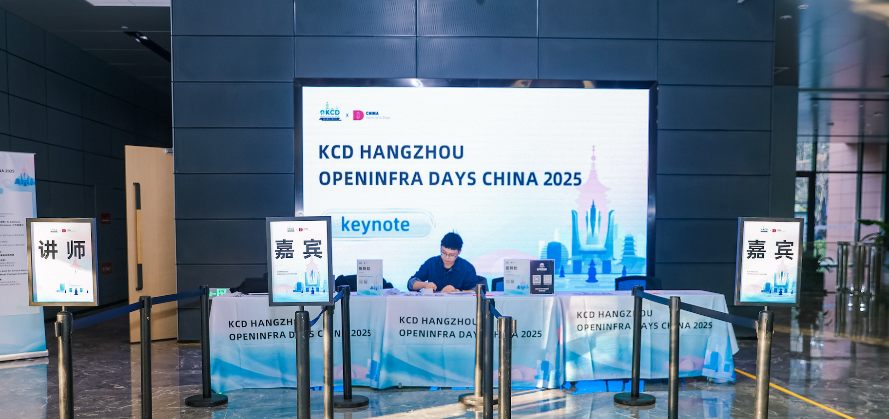

---
cover:
  image: cover.jpg
date: '2025-11-17T00:46:00.000Z'
draft: true
lastmod: '2025-11-18T14:03:00.000Z'
tags: []
title: KCD Hangzhou 2025

---

> [KCD Hangzhou + OpenInfra Days China 2025,云原生,人工智能,开源,大模型,KCD Hangzhou 2025 组委会,OpenInfra 中国用户组,](https://www.bagevent.com/event/9093587?discountCode=volunteer)
[照片直播 | KCD HANGZHOU OPENINFRA DAYS CHINA 2025](https://m.alltuu.com/album/2023712153/?menu=live)

周末作为志愿者参加了 KCD Hangzhou 的活动，活动地址在浙大紫荆港边上，离公司不远。

# 谈谈几点收获

这次被安排在签到台，最直观的好处就是可以跟大佬面对面，在这个过程中结识了 Kong 上海的负责人黄总、蚂蚁 Kata infra 团队的大佬们、通义实验室百炼平台负责人于总、蚂蚁 Nydus 容器团队的工程师。

在深入的沟通中，也了解到了在 AI 热的大背景下，目前国内大厂顶尖的 infra 团队在虚拟化层、镜像交付层、MaaS 调度层正在推进哪些工作以及遇到了哪些挑战。

# 关于 MaaS

百炼平台的 MaaS 无疑是顶级的，托管了众多不同类型、不同规格的模型。百炼在底层资源层面采用了 K8s 来进行统一纳管，在上层则自研了诸如 DashServing、DashMesh、DashScaler 等组件。在这个框架下，遇到了一个问题，目前 K8s 只提供了基于 Pod 生命周期的管理，没有提供基于 Model 的生命周期管理。这样会导致在模型切换时，如果直接使用 K8s 的原语，那么只能对 Pod 进行重建，这样切换模型的开销是巨大的，一方面 Pod 可能会被调度到其他节点，另外，模型的装载与卸载相比在 Serving 服务内做也会有一定的开销。因此，于文渊就提出了在 AI 推理的背景下，是否一定需要 K8s？

 

会后也请教了在 MaaS 层如何做到高效的模型切换，特别是在加载 DeepSeek-V3 这类超大模型。解决方案是通过 P2P 从其他节点获取模型文件，同时需要少量 hack 读取 safetensors 代码。这个思路让我恍然大悟。在我们的业务场景下，ComfyUI 会加载很多不同种类的模型，加载时均需要从磁盘读取到内存，然后再放到 GPU 显存中。那么，有没有可能构建一个 p2p 的网络来分发这些模型，而不是每台机器通过 rclone fuse 的方式来挂载 S3？ 

# 关于 Nydus

Nydus 是一个非常好的点子，在 AI 的场景下，镜像中大部分文件是没有改变的，例如，一些 python 库的 so 文件等。打破原本 docker 镜像按文件系统层打包存储的逻辑，改为按照文件分块进行存储，从而避免了重复文件反复下载的问题。整个方案蚂蚁内部有 80% 的容器在使用，后续也有规划做 ModelRuntime，感觉有点类似 ollama 的定位。

# 谈谈几点感想

- 在这轮生成式 AI 的大背景下，国内大厂相对会更加具有优势，有钱、有人才、有技术沉淀、有场景。

- 国内大厂的部分团队研究的内容也更具前瞻性，例如 kata 安全容器，绝大部分场景根本用不到，但是只针对高机密场景，而这些场景普通人碰不到。

- 就像百炼这样的产品，很多情况下需要有足够大的使用量了才会遇到技术难题，或者才有必要通过技术手段来优化成本。至少通过百炼来看，公司财务对成本这块的控制还是比较强势的，从而倒逼技术做优化。

- 阿里集团、蚂蚁、阿里百炼、通义实验室，在阿里系内部，其实也存在大量重叠的产品。就像蚂蚁有独立的 infra 团队，而不使用阿里云。MaaS 也有多个团队在做，只是一个对外，一个对内。

