---
cover:
  image: cover.jpg
date: '2025-11-29T03:18:00.000Z'
draft: false
lastmod: '2025-12-01T13:38:00.000Z'
tags:
- AI
- 推理
title: 🤖 解构极速权重同步：从内存寻址到流⽔线引擎

---

# 背景

在 KCD Hangzhou 的活动中有幸跟百炼的于文渊大佬做了交流，得知在模型同步可以考虑 p2p 分发的方式。于是做了一个简单的调研，发现 Kimi 开源的推理引擎 Mooncake 也提供了类似的方法，就花时间阅读了下源码，共涉及 [Mooncake](https://github.com/kvcache-ai/Mooncake) 和 [checkpoint-engine](https://github.com/MoonshotAI/checkpoint-engine) 两个项目。 实话说，本人对 AI 硬件与内核联动相关领域并不熟悉，因此在阅读源码过程中，有很多专业性的技术了解甚少，理解起来十分吃力。好在如今有 Copilot 协助，才得以完成代码阅读。在这个过程中也发现一个很有意思的阅读源码的方法：

1. 在 VSCode 中让 Github Copilot 进行辅助阅读源码，针对不明白的点，及时提问

1. 等所有细节都整理清楚后，将与 Copilot 的聊天内容导入到 NotebookLM 中

1. 在 NotebookLM 中，再次对内容进行梳理，NotebookLM 也会主动引导提问

1. 对 NotebookLM 每轮返回的结果进行评估，如果符合预期则保存为 note

1. 在 NotebookLM 中，将所有保存的 note 作为 source，然后通过「Slide Deck」生成 Slide

接下来，我将使用生成的 Slide，来分析大模型 p2p 分发的逻辑。

# 核⼼挑战：⼤模型时代下的权重更新瓶颈

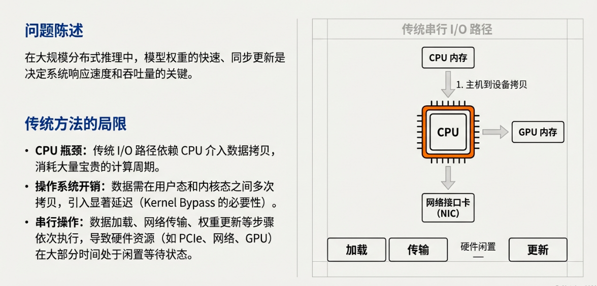

## 优化一：提供硬件直达，消除中介

通过「内存注册」，提供硬件可直接操作的物理地址

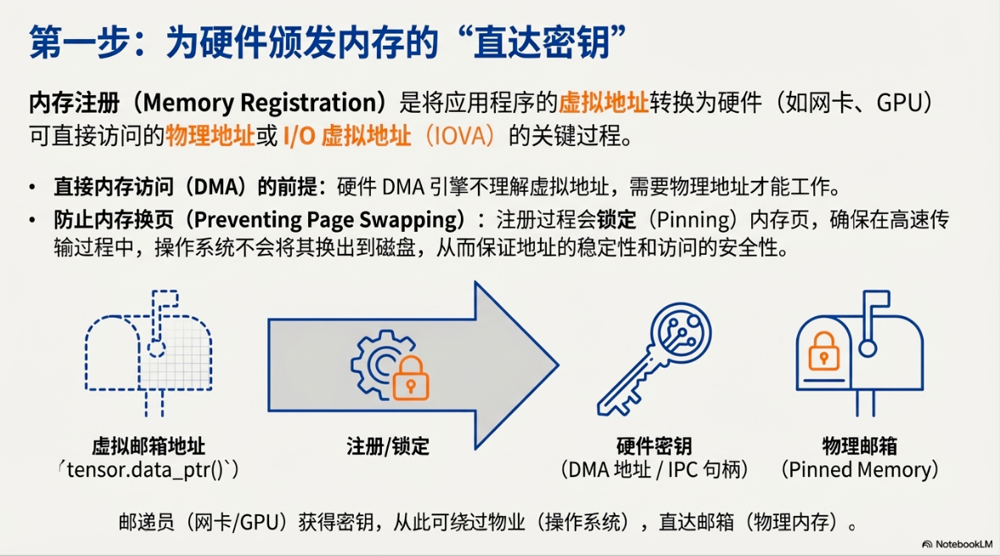

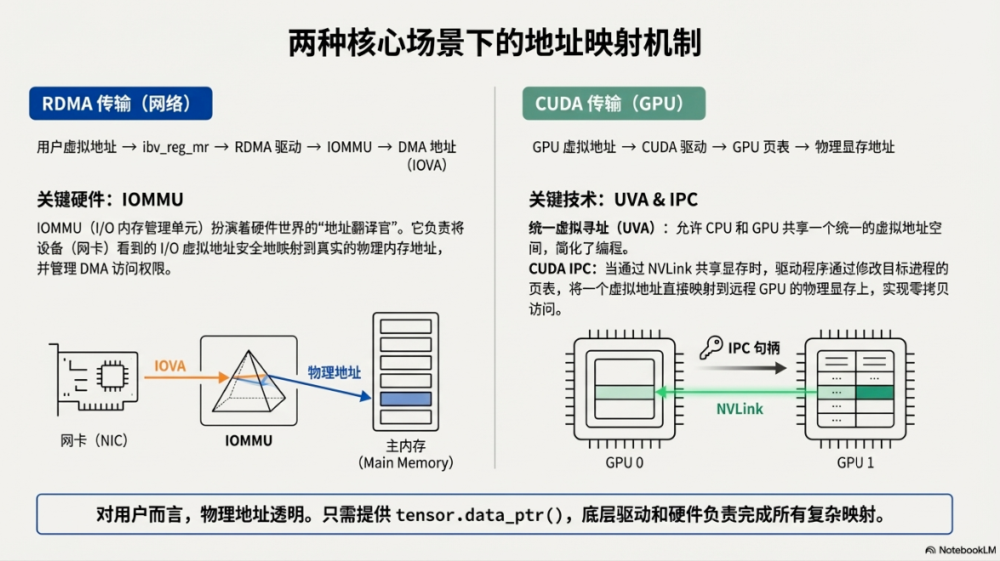

# 优化二：零拷贝与内核旁路，告别开销

利用 RDMA 和 NVLink & CUDA IPC 技术，实现内存和硬件之间的直接流动，完全绕过 CPU 和操作系统内核。

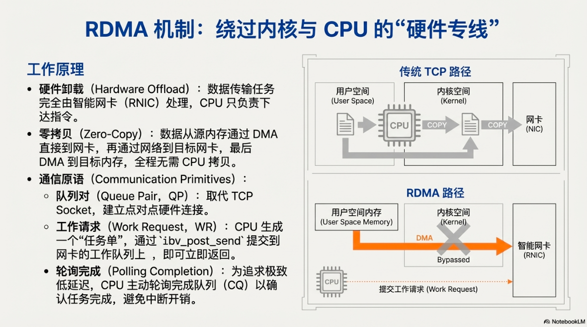

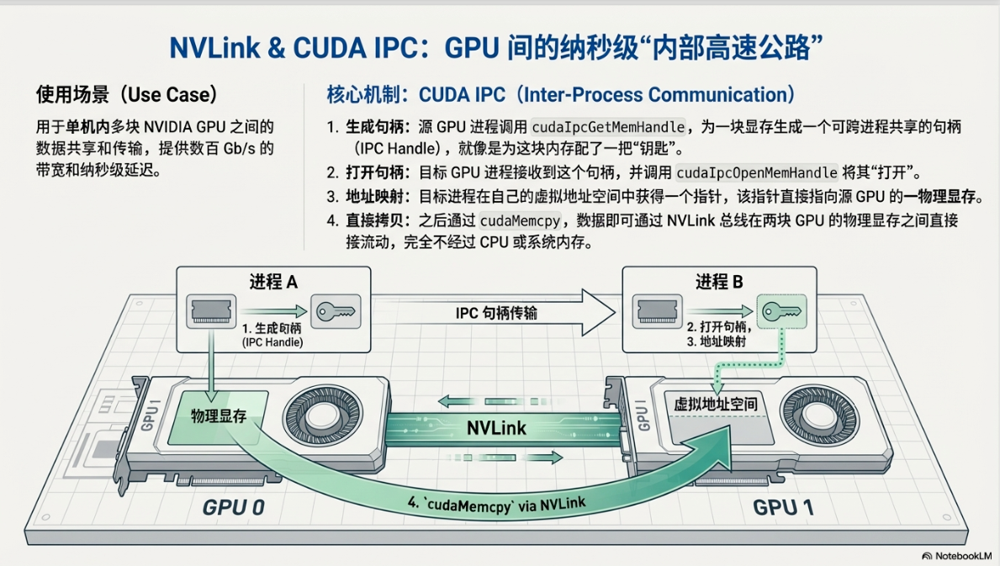

# 优化三：利用 P2P 以及流水异步化机制，压榨并行

> 这里需要补充一点，在 checkpoint-engine 中 P2P 只在 h2d 阶段获取原始权重时才会用到，其余权重同步逻辑均由 NCCL 库来实现。

### 单 GPU 视角

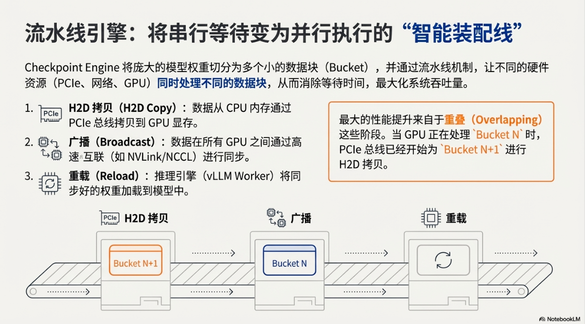

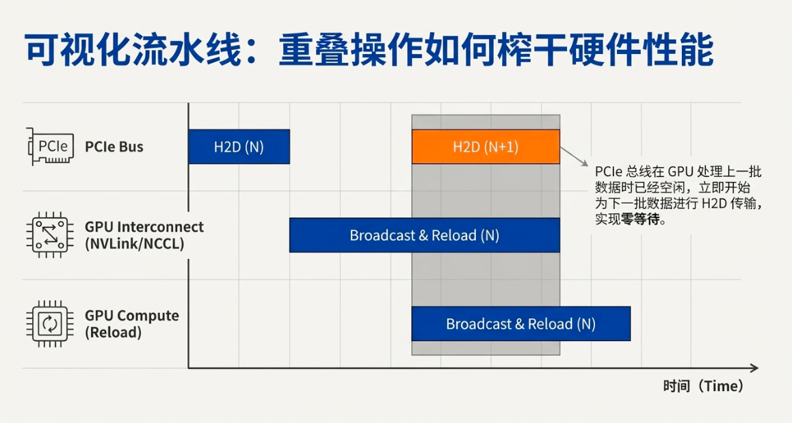

### 多 GPU 视角

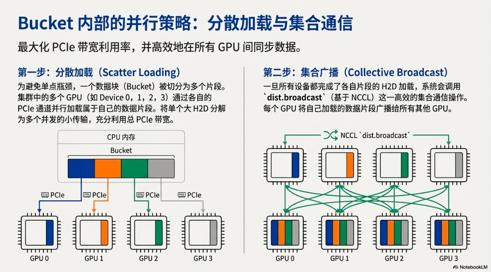

# 总体架构回顾

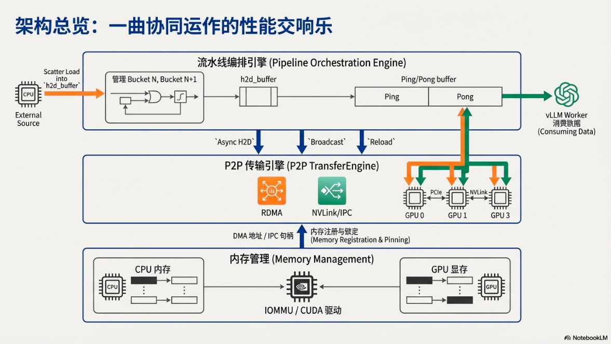

# P2P 分发 & vLLM 更新权重

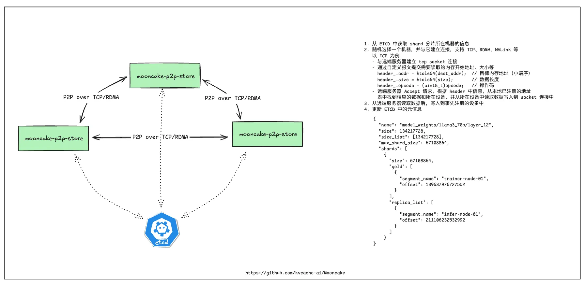

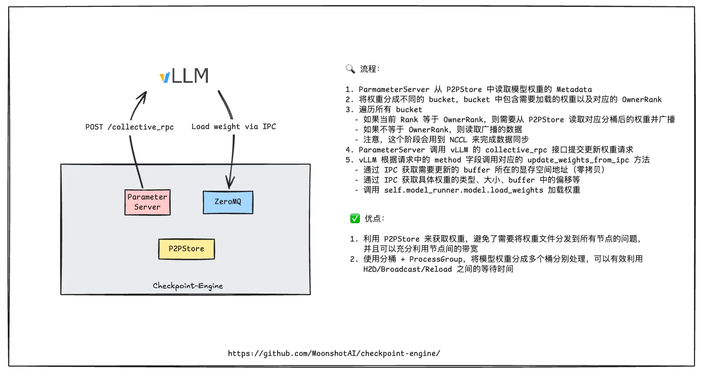

# 总结 & 思考

Mooncake 项目中的 TransferEngine 提供了内存注册以及卡间传输的多个方法，Checkpoint engine 在 TE 之上增加了 P2P Store 和权重 bucket pipeline 同步机制，加速模型分发速度。

此架构下有几个优点：

1. 权重按 bucket 细分后，可以充分利用 PCIE、RDMA 性能，减少硬件闲置

1. 巧妙的利用 Ping/Pong buffer 来实现读写分离，保证高效并行

缺点：

1. 直接使用 NCCL 库来做同步，而不是 TransferEngine 的 P2P 来做，蛮可惜的，无法确定 TransferEngine P2P  的性能

1. NCCL 同步需要保证所有 GPU 都完成操作，一旦有一个没有完成，则所有进程均会卡住

 

最后，能否用到 ComfyUI 场景上？目前来看并不合适，checkpoint engine 面向的场景是 Kimi 模型从训练集群如何快速更新到推理集群的问题，在这个场景下可以保证权重文件一定可以在 P2P store 中找到，而 ComfyUI 场景中，模型替换非常频繁，很大程度上无法在 P2P 网络里找到对应的权重，最后还是要回退到从磁盘读取模型权重。再说说类似百炼这类 MaaS 场景，这种场景下是合适的，模型更替频率不高，但是一旦发生更替，速度需要越快越好，以减少服务不可用时间。

