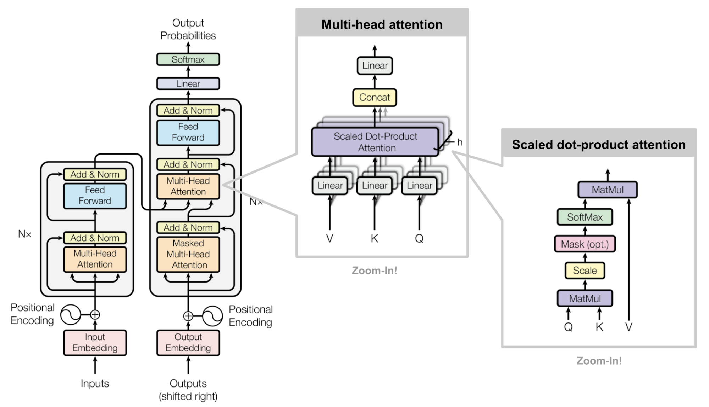
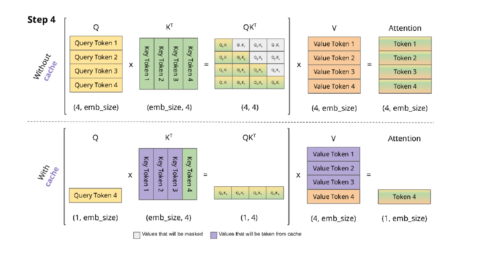
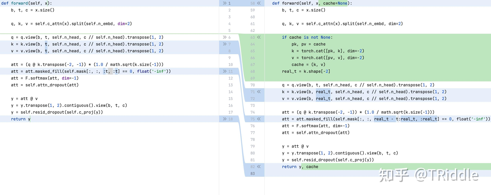
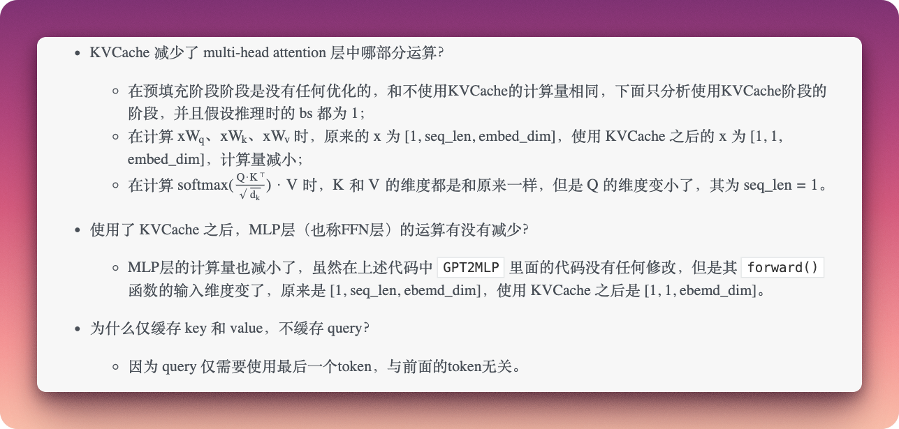
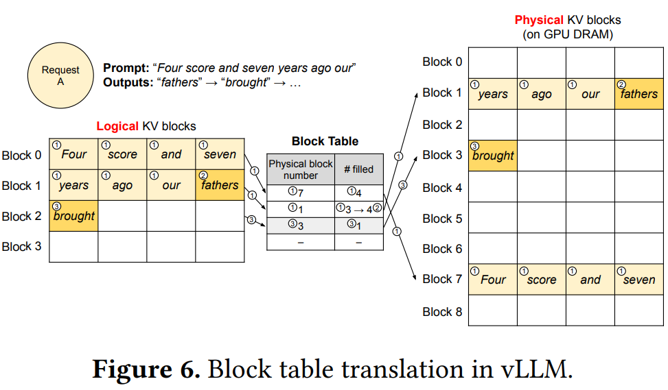
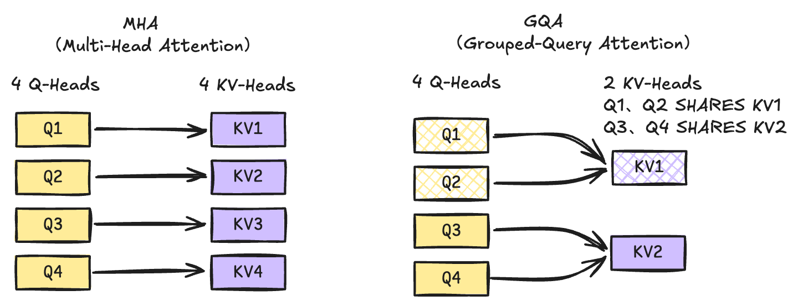

---
cover:
  image: cover.jpg
date: '2026-04-01T09:01:00.000Z'
draft: false
lastmod: '2026-04-02T01:53:00.000Z'
tags:
- AI
- 推理
title: LLM 推理加速技巧 KVCache 解析

---

💡 最近李宏毅老师更新了关于 KVCache 的教学视频，正好趁这个机会整理了下 KVCache 原理相关内容。

> 核心原理：transformer 架构是自回归的，在计算 Attention 是会用到过去的 key 和 value，缓存这些值通过空间换时间的方式，提高算力计算效率。

# 原理分析

> [Understanding and Coding the Self-Attention Mechanism of Large Language Models From Scratch](https://sebastianraschka.com/blog/2023/self-attention-from-scratch.html)



1. 输入的句子通过 tokenizer 进行分词

1. 对每个 token 进行 embedding 得到 embedding 向量

1. x 向量乘上预先训练好的权重矩阵 Wq、Wk、Wv 得到 q、k、v 向量

1. 使用 attention 公式计算得到 z 向量

1. 通过预先训练的好的权重矩阵可以得到 Query Token 1、Key Token 1 和 Value Token 1

1. 使用 Attention 公式，计算得到 Token 1 对应的 Attention

1. 通过 softmax 层并全连接到词表得到 Token 2



# 代码实现

- 在 Prefill 阶段，由于所有的 token 都是已知的，无需 cache，参数 x 对应的是完整的输入向量，直接进行 attention 计算

- 在 Decode 阶段，参数 x 为前一次新生成 token，cache 为 kv 缓存值。



# KVCache 大小估算


```javascript
2 * b * n_head * s * head_dims * N
```

- num_attention_heads 是注意力头数量，对应的是 n_head，数值 64

- hidden_size 是隐藏层的特征维度大小，需要除以注意力头的数量，得到 head_dims，数值：8192/64

- num_hidden_layers 是隐藏层数量，对应的是 N，数值 80

- max_position_embeddings 是最大长度，对应的是 s，数值 32768


```javascript
(2 * b * n_head * s * head_dims * N) * 2 \
= 2 * 1 * 64  * 32768 * 8192/64 * 80 * 2 \
= 80G
```

💡 `**num_attention_heads**` 对应 **Query (Q)** 的头数，`**num_key_value_heads**`** ** 对应 **Key (K)** 和 **Value (V)** 的头数



## Paged Attention



# GQA（Grouped-Query Attention）



# 参考资料

- [https://sebastianraschka.com/blog/2023/self-attention-from-scratch.html](https://sebastianraschka.com/blog/2023/self-attention-from-scratch.html)

- [https://mp.weixin.qq.com/s/zoL19W1aghcWYedFoxcM0w](https://mp.weixin.qq.com/s/zoL19W1aghcWYedFoxcM0w)

- [https://www.zhihu.com/question/596900067/answer/3040011798](https://www.zhihu.com/question/596900067/answer/3040011798)

- [https://www.youtube.com/watch?v=fDQaadKysSA](https://www.youtube.com/watch?v=fDQaadKysSA)

<br/>

